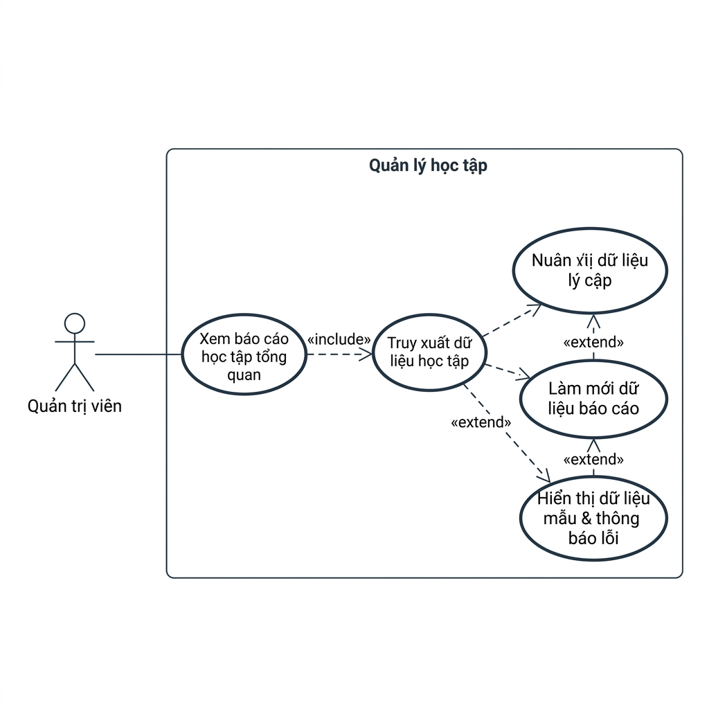
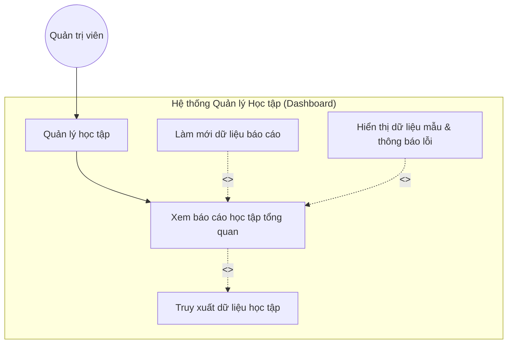
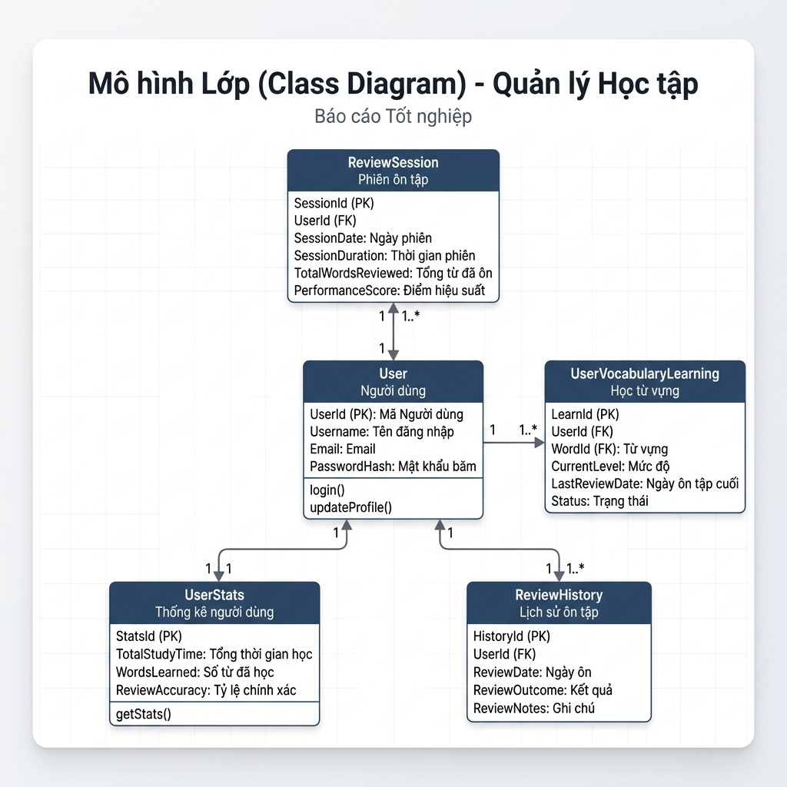
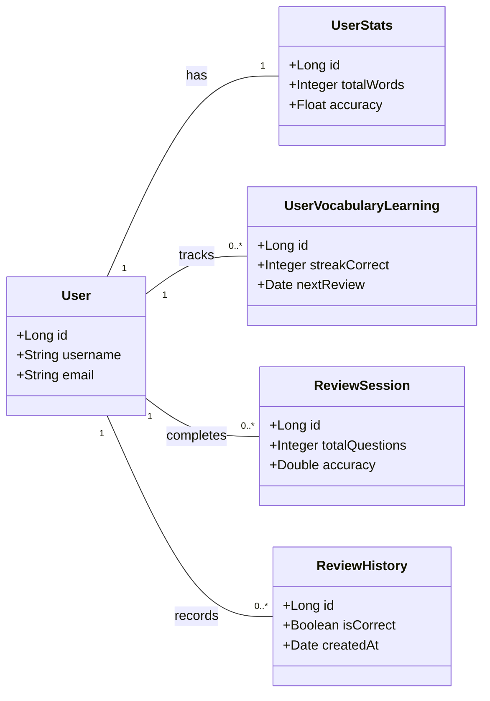

# Phân tích Chi tiết Use Case: Quản lý Học tập (UC_QuanLyHocTap)

Tài liệu này tổng hợp toàn bộ thông tin phân tích về Use Case **Quản lý Học tập**, bao gồm sơ đồ phân rã chức năng, sơ đồ quan hệ Entity, và sơ đồ Use Case với các mối quan hệ `<<include>>` và `<<extend>>`.

---

## 1. Sơ đồ Phân rã Chức năng (BFD)

```
Quản lý Học tập (Learning Management)
├── 1. Xem báo cáo học tập tổng quan
│   └── 1.1. Truy xuất dữ liệu từ các bảng DB
├── 2. Làm mới báo cáo (Refresh)
└── 3. Hiển thị thông báo lỗi & Dữ liệu mẫu (Fallback)
```

---

## 2. Sơ đồ Use Case phân rã (với include, extend)

Bạn có thể xem trực tiếp hình ảnh sơ đồ Use Case được tạo ra bên dưới:





### Giải thích các mối quan hệ:
- **`<<include>>`:** Khi xem báo cáo, hệ thống **bắt buộc** phải thực hiện `Truy xuất dữ liệu học tập` từ DB.
- **`<<extend>>`:** Admin có thể tùy chọn thực hiện `Làm mới dữ liệu báo cáo`. Trường hợp xảy ra lỗi, luồng thay thế `Hiển thị dữ liệu mẫu & thông báo lỗi` sẽ được kích hoạt.

---

## 3. Sơ đồ quan hệ Entity (Database Relationship)

Các chỉ số hiển thị trên Dashboard được tổng hợp từ 4 thực thể chính liên kết gián tiếp thông qua **`User`**:





---

## 4. Bảng truy xuất dữ liệu từ Database

| STT | Tên Bảng (Table) | Thông tin lấy ra | Mục đích hiển thị trên Dashboard |
| :--- | :--- | :--- | :--- |
| **1** | `user_vocabulary_learning` | Số từ đang theo dõi ôn tập, số từ đã nắm vững hoàn toàn. | Hiển thị thẻ: **"Lượng từ đang học"**, **"Từ đã nắm vững"**, và biểu đồ **"Sản lượng từ vựng"**. |
| **2** | `review_sessions` | Lịch sử điểm số và độ chính xác của các phiên ôn tập. | Hiển thị thẻ: **"Hiệu suất học tập"**, **"Độ chính xác trung bình"**, và biểu đồ **"Chất lượng ghi nhớ (%)"**. |
| **3** | `review_history` | Tổng số lượt phản hồi ôn tập, số từ vựng được học mới trong ngày. | Hiển thị thẻ: **"Sức tải hệ thống SRS"**, **"Từ vựng mới mỗi ngày"**. |
| **4** | `user_stats` | Tiến độ và tỷ lệ hoàn thành bài học của người dùng. | Hiển thị thẻ: **"Tỷ lệ hoàn thành"**, **"Hoàn thành bài học"**, và biểu đồ **"Khối lượng bài học (Sessions)"**. |
